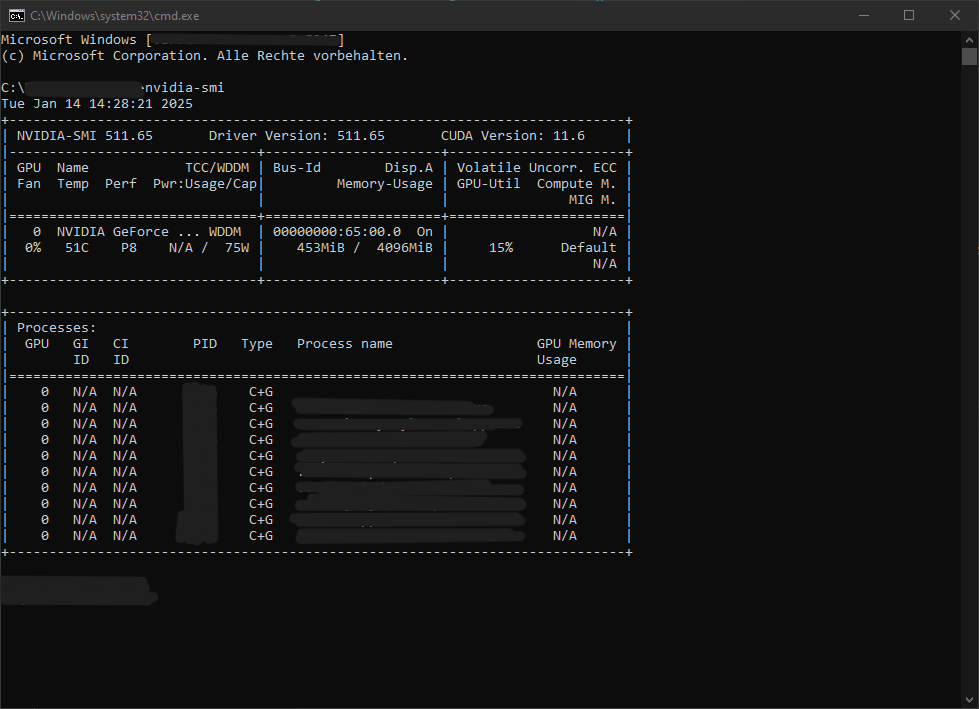

# Nutzbarmachung der Grfischen Schnittstelle 
## Vorwort/ requirements ##
Zum Nutzen der Schnittstelle der Grafikkarte sind folgende Installationen vorzunehemen:

CUDA Toolkit. Ich nutze es in der Version 11.6. Zur Versionspprüfung `nvcc --version` nutzen. [https://developer.nvidia.com/cuda-toolkit-archive](https://developer.nvidia.com/cuda-toolkit-archive "CUDA Toolkit") 

Python nutze ich in der Version 3.11. Welche Version auf dem Pc bereits installiert ist kann hierüber ermittelt werden: `python --version` [https://www.python.org/downloads/](https://www.python.org/downloads/ "Python") 

Für weitergehende Programmierer: [https://developer.nvidia.com/nvidia-nsight-visual-studio-edition](https://developer.nvidia.com/nvidia-nsight-visual-studio-edition "NVIDIA Nsight Visual Studio Edition")

Ziel des Vorganges ist speziell für OpenTrafficCam die Schnittstelle der Grafikkarte zur beschleunigten Bildverarbeitung zu nutzen.

Für weitergehende Programmierer: [https://developer.nvidia.com/nvidia-nsight-visual-studio-edition](https://developer.nvidia.com/nvidia-nsight-visual-studio-edition "NVIDIA Nsight Visual Studio Edition")

Ziel des Vorganges ist speziell für OpenTrafficCam die Schnittstelle der Grafikkarte zur beschleunigten Bildverarbeitung zu nutzen.

<h3>Voraussetzungen für GPU-Beschleunigung</h3>
<h5>Kompatible GPU-Hardware:</h5>

- NVIDIA-GPU: Die meisten ML-Frameworks (z. B. TensorFlow, PyTorch) unterstützen CUDA, das nur mit NVIDIA-GPUs funktioniert. 
- AMD-GPUs oder andere Marken werden oft nicht unterstützt.
 
<h5>Installierte GPU-Treiber:</h5>
Stelle sicher, dass der neueste NVIDIA-Treiber installiert ist:

    nvidia-smi

Dieser Befehl zeigt Informationen zu deiner GPU und ihrer aktuellen Nutzung:

 
<h5>Framework-Unterstützung:</h5>
OpenTrafficCam verwendet Frameworks wie TensorFlow oder PyTorch. Stelle sicher, dass du die GPU-Version des Frameworks installiert hast:

    pip install tensorflow-gpu
    # oder für PyTorch
    pip install torch torchvision torchaudio --index-url https://download.pytorch.org/whl/cuXX
    # (ersetze "cuXX" durch deine CUDA-Version, z. B. cu118 für CUDA 11.8)
 
Folgende install-Befehle haben ohne Fehlermeldung bei mir funktioniert:

    pip install tensorflow
    pip install torch

<h5>Ursachen für CPU-Nutzung statt GPU</h5>
- GPU wird nicht erkannt

    import torch
    print("CUDA verfügbar:", torch.cuda.is_available())
    print("GPU-Name:", torch.cuda.get_device_name(0) if torch.cuda.is_available() else "Keine GPU")

    import tensorflow as tf
    print("CUDA verfügbar:", tf.test.is_built_with_cuda())
    print("GPU verfügbar:", tf.config.list_physical_devices('GPU'))

- Falsche Framework-Version
- Fehlende CUDA-Unterstützung
- Konfiguration des Tools:
    OpenTrafficCam könnte explizit so eingestellt sein, dass die CPU genutzt wird. Überprüfe die Konfigurationsdateien oder den Code, ob es eine Einstellung wie `use_gpu` gibt, die aktiviert werden muss.

Wenn sich keine Lösung abzeichnet, alles einmal updaten und PC neustarten.
Ein weiterer Ansatz ist, dass die Virtuelle die GPU Schnittstelle nicht ansprechen kann. So ist die Umgebung zu aktivieren und die oben benannten Prüfungen erneut durchzuführen. So können auch differente Versionen in der Umgebung zu einem Verlust führen.
Prüfen auf Path- Einträge in der Konsole:

    echo %PATH%
    echo %CUDA_HOME%

Wenn die Pfade nicht angezeigt werden: 

    # Pfade bitte entsprechend anpassen!
    set PATH=C:\Program Files\NVIDIA GPU Computing Toolkit\CUDA\v11.6\bin;%PATH%
    set CUDA_HOME=C:\Program Files\NVIDIA GPU Computing Toolkit\CUDA\v11.6

Füge Systempfade zur venv hinzu: Die virtuelle Umgebung kann die Systempfade automatisch übernehmen, wenn du sie mit der Option --system-site-packages erstellst:

    python3 -m venv venv --system-site-packages
